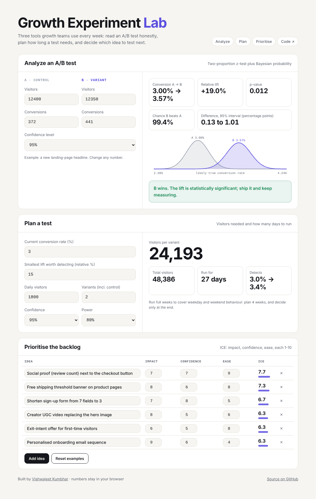

# Growth Experiment Lab

**Three tools a growth team uses every week, in one page: read an A/B test honestly, plan how long a test needs, and decide what to test next.**

**▶ Live app: [vishwajeetkumbhar379.github.io/growth-experiment-lab](https://vishwajeetkumbhar379.github.io/growth-experiment-lab/)**



## The three tools

**1. Analyze an A/B test.** Enter visitors and conversions for control and variant. You get the conversion rates, relative lift, p-value from a two-proportion z-test, the confidence interval for the difference, and the Bayesian probability that B beats A. A chart shows how much the two plausible conversion rates overlap, which helps people without a stats background see why a result is or isn't convincing. The verdict is written in plain language and warns against stopping a test early.

**2. Plan a test.** Enter the current conversion rate, the smallest lift worth detecting, daily traffic and number of variants. You get visitors per variant, total visitors and how many days to run, rounded to full weeks so weekday and weekend behaviour are both covered. With more than two variants, confidence is Bonferroni-adjusted. If a test would take over six weeks, it suggests testing a bolder change or an earlier funnel step instead.

**3. Prioritise the backlog.** Score each idea on impact, confidence and ease (ICE, 1-10). The list re-sorts as you edit, and your ideas stay in your browser.

## Correctness

All maths lives in [`stats.js`](stats.js) as pure functions with no dependencies, and is tested against textbook values in [`tests/stats.test.mjs`](tests/stats.test.mjs):

- Normal CDF (Zelen & Severo) and inverse (Acklam), accurate to better than 1e-7
- 10,000 visitors per arm at 3.0% vs 3.6% gives z ≈ 2.37, p ≈ 0.018
- Baseline 5%, +20% relative lift, 95% confidence, 80% power needs ≈ 8,158 visitors per variant

```bash
npm test
```

## Run it

No build step. Open `index.html` in a browser, or serve the folder:

```bash
git clone https://github.com/Vishwajeetkumbhar379/growth-experiment-lab
cd growth-experiment-lab
python3 -m http.server 8000   # then open http://localhost:8000
```

The `deploy` workflow publishes it to GitHub Pages on every push.

## Why I built it

Most marketing teams run A/B tests, but few read them correctly. They stop when the dashboard turns green, or ignore a real result because it "looks small". I wanted one place that does the maths properly and explains the answer the way you'd explain it to a client.

---

Built by [Vishwajeet Kumbhar](https://www.linkedin.com/in/vishwajeetkumbhar379) with Claude Code. MIT licence.
